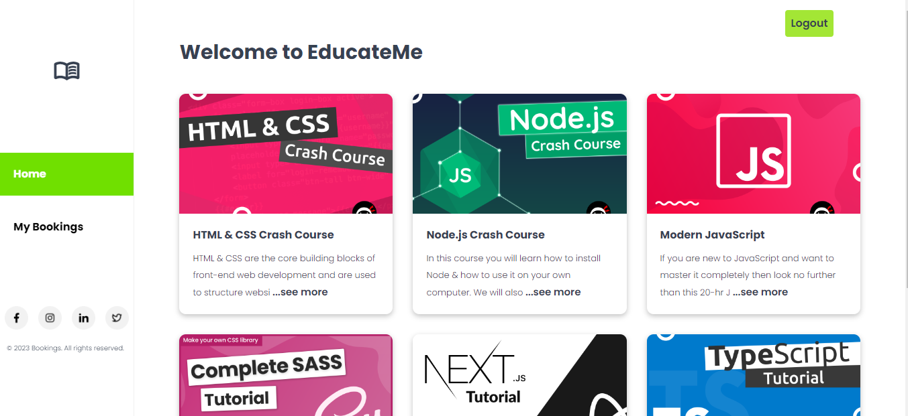
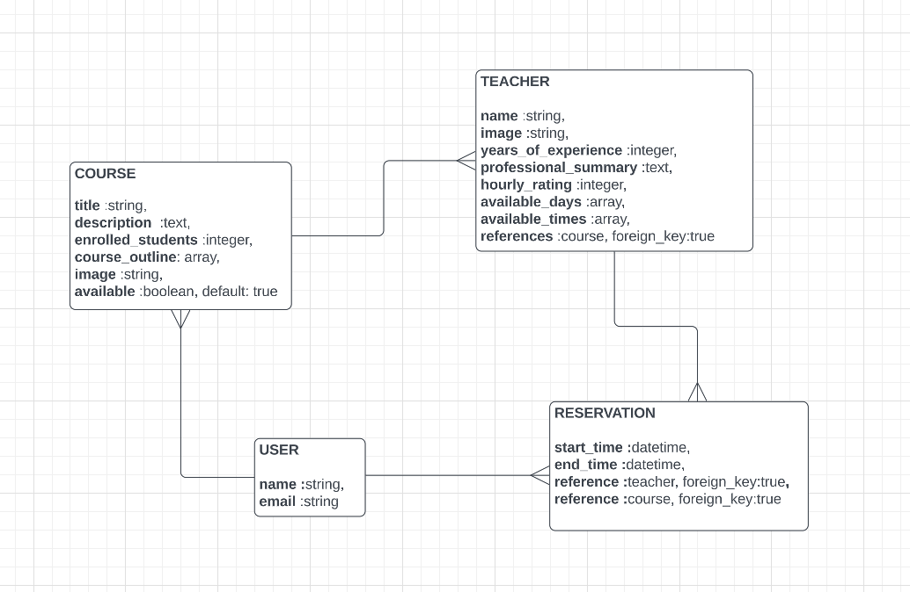

<a name="readme-top"></a>

<!-- TABLE OF CONTENTS -->

# 📗 Table of Contents

- [📖 About the Project](#about-project)
  - [🛠 Built With](#built-with)
    - [Tech Stack](#tech-stack)
    - [Key Features](#key-features)
    - [Website Mockup 📱 💻 🖥️](#screenshots)
    - [🖺 Entity Relationship Diagram](#er-diagram)
  - [ Kanban Board](#kanban-board)
  - [ React Frontend](#react-frontend)
  - [ API Documentation](#api-docs)
  - [🚀 Live Demo](#live-demo)
  
- [💻 Getting Started](#getting-started)
  - [Setup](#setup)
  - [Prerequisites](#prerequisites)
  - [Install](#install)
  - [Usage](#usage)
  - [Run tests](#run-tests)
  - [Deployment](#triangular_flag_on_post-deployment)
- [👥 Authors](#authors)
- [🔭 Future Features](#future-features)
- [🤝 Contributing](#contributing)
- [⭐️ Show your support](#support)
- [🙏 Acknowledgements](#acknowledgements)
- [❓ FAQ](#faq)
- [📝 License](#license)

<!-- PROJECT DESCRIPTION -->

# 📖 EducateMe Backend <a name="about-project"></a>
- Homepage


**EducateMe** is a course booking platform that allows a user to reserve a course taken by a specific teacher of their liking. It is built and connected by using two different repos: Back-end(Rails) and Front-end(React/Redux).

## 🛠 Built With <a name="built-with"></a>

### Tech Stack <a name="tech-stack"></a>

<details>
  <summary>Client</summary>
  <ul>
    <li><a href="https://reactjs.org/">React.js</a></li>
  </ul>
</details>

<details>
  <summary>Server</summary>
  <ul>
    <li>Rails</li>
  </ul>
</details>

<details>
<summary>Database</summary>
  <ul>
    <li><a href="https://www.postgresql.org/">PostgreSQL</a></li>
  </ul>
</details>

<!-- Features -->

### Key Features <a name="key-features"></a>

- **Course List endpoints**
- **Authentication to access Courses, Teacher and Reservations**
- **Authenticated Users can add/remove a reservations**

<p align="right">(<a href="#readme-top">back to top</a>)</p>

<!-- ER DIAGRAM-->
## :card_index: Entity Relationship Diagram <a name="er-diagram"></a>


<!-- React Frontend -->
##  React Frontend <a name="react-frontend"></a>
- Here is the Frontend part of the project [Front End](https://github.com/keebot-png/booking-front-end)

## 🚀 kanban board <a name="board"></a>

## List of requirements:
- [x] There are four team members in total.
- [x] Kanban board [LINK](https://github.com/users/keebot-png/projects/3/views/1).
## Screenshot of the kanban board:
 

## 🚀 Live Demo <a name="live-demo"></a>

- [Live Demo] :smiley:

<p align="right">(<a href="#readme-top">back to top</a>)</p>

<!-- GETTING STARTED -->
## 💻 Getting Started <a name="getting-started"></a>

To get a local copy up and running, follow these steps.
### Prerequisites

To run this project you need:
`Git` and `Ruby`
```
 gem install rails
```

### Install

Install this project with:
(Check the your ruby version first and if it is different then you can add your version to the gemfile)
```sh
  bundle install
```
- To run the rails server, strictly follow the instructions layed out the screenshot:
- NB: If you have a config/credentials.yml.enc delete it, as it will install another key for you when following the instructions below.


For more context, you can go to this [link](https://github.com/yahyaelganyni1/devise-jwt-app1).

Change the username and password within the config.database.yml to your own username and password as specified below.
```
username = {YOUR DATABASE USERNAME || postgres}
password = {YOUR DATABASE PASSWORD}
```
Create a Database (Mandatory)

```
rails db:create
```
If you have made a migration then run this command

```
rails db:migrate
```
Run the seed folder.
```
rails db:seed
```
### Usage

To run the project on the backend, execute the following command:

```sh
   rails s  # to run the server on default port 3000
   # to be able to access the database
```
To run the project on the frontend, execute the following command:

```sh
   npm run dev  # to run the server on default port 3000
   # to be able to access the database
```

<p align="right">(<a href="#readme-top">back to top</a>)</p>

<!-- AUTHORS -->

## 👥 Authors (4 Micronauts) <a name="authors"></a>

👤 **Keenan Botes**

- GitHub: [@keebot-png](https://github.com/keebot-png)
- Twitter: [@KeenanBotes](https://twitter.com/KeenanBotes)
- LinkedIn: [kee.bot@icloud.com](https://www.linkedin.com/in/keenan-botes-947043160)

👤 **Linus shaddai**

- GitHub: [@linushaddai99](https://github.com/linushaddai99)
- LinkedIn: [@linusshaddai](https://www.linkedin.com/in/linusshaddai/)
-Twitter: [@ShaddaiLinus](https://twitter.com/ShaddaiLinus)

👤 **Kennedy Omondi**

- GitHub: [@kennankole](https://github.com/kennankole)
- Twitter: [@obwombe_kennedy](https://twitter.com/obwombe_kennedy)
- LinkedIn: [LinkedIn](https://www.linkedin.com/in/kennedyomondi/)

👤 **onwuanibe Onomeh** 

- GitHub: [@githubhandle](https://github.com/Estherstarr/)
- Twitter: [@twitterhandle](https://twitter.com/AnibeEsther)
- LinkedIn: [LinkedIn](https://linkedin.com/in/onwuanibeonome)

<p align="right">(<a href="#readme-top">back to top</a>)</p>

<!-- FUTURE FEATURES -->

## 🔭 Future Features <a name="future-features"></a>

- [ ] **Admin Roles and access to the latest courses**
- [ ] **Keep count of enrolled students to indicate popularity of the course**

<p align="right">(<a href="#readme-top">back to top</a>)</p>

<!-- CONTRIBUTING -->

## 🤝 Contributing <a name="contributing"></a>

Contributions, issues, and feature requests are welcome!

Feel free to check the [issues page](../../issues/).

<p align="right">(<a href="#readme-top">back to top</a>)</p>

<!-- SUPPORT -->

## ⭐️ Show your support <a name="support"></a>

Give a ⭐️ if you like this project!

<p align="right">(<a href="#readme-top">back to top</a>)</p>

<!-- ACKNOWLEDGEMENTS -->

## 🙏 Acknowledgments <a name="acknowledgements"></a>

I would like to thank:
- [Microverse](https://www.microverse.org/)
- Code Reviewers


<p align="right">(<a href="#readme-top">back to top</a>)</p>

<!-- FAQ (optional) -->

## ❓ FAQ <a name="faq"></a>

- **How I can install rails?**

  - You can follow the [official guide](https://guides.rubyonrails.org/getting_started.html#installing-rails) to install rails. If you have gem installed, you can run `gem install rails` to install rails.

- **How I can run tests?**
  
    - After cloning the repository, run `bundle` and then run `rspec` to run the tests. 
<p align="right">(<a href="#readme-top">back to top</a>)</p>

<!-- LICENSE -->

## 📝 License <a name="license"></a>

This project is [MIT](./license) licensed.

<p align="right">(<a href="#readme-top">back to top</a>)</p>